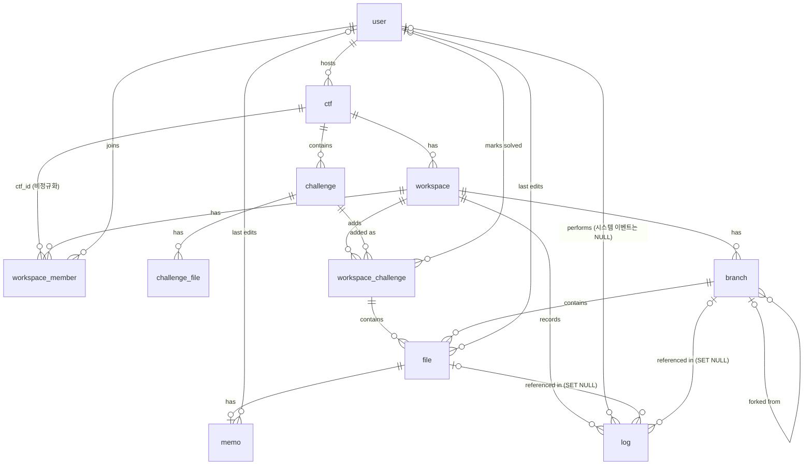

# ERD (수정본)

> DB 스키마의 정본. Notion "ERD 컬럼 정의"(PM 확정본, 2026-09-22)를 가져와 아래 [변경 사항](#원본-대비-변경-사항)을 반영했다.
> 원본 그림은 [`erd-original.jpg`](erd-original.jpg)이며 **변경 전** 상태다. 그림과 이 문서가 다르면 이 문서를 따른다.
> 제품 결정은 `README.md`가 우선이고, 기능별 동작은 [`feature-spec.md`](feature-spec.md)를 본다.

- 11개 엔티티. PK는 모두 `char(36)` UUID 단일 구조다(순차 PK를 따로 두지 않는다). 인덱스 지역성을 위해 UUID v7 생성을 권장한다.
- 시각은 모두 UTC로 저장한다 (`datetime(6)`). 코드에서는 `OffsetDateTime`/`Instant`로 다루고, API 응답에서 오프셋을 붙인다.
- 암호화 대상은 파일 내용·메모뿐이다. 파일 경로와 로그 메타데이터는 평문이다.

## 관계도

## 원본 대비 변경 사항

| # | 대상 | 변경 | 이유 |
|---|---|---|---|
| 1 | `workspace_member` | `ctf_id` 추가, `UNIQUE(ctf_id, user_id)` 추가 | 한 CTF에서 한 유저가 두 팀에 속하면 타팀 워크스페이스를 볼 수 있다. 팀 격리가 핵심 가치라 DB로 막는다. 스펙의 "같은 CTF의 다른 팀에 이미 등록된 유저 → 409"와도 일치 |
| 2 | `ctf.master_key_encrypted` | **nullable**로 변경, 서버 KEK로 감싼다는 규칙 명시 | 접근 허용 기간이 지나면 키를 폐기(NULL)해야 한다. DB 유출만으로 키가 풀리지 않도록 감싸는 키(KEK)는 DB 밖에 둔다 |
| 3 | `workspace` | `kdf_params` 추가 | Argon2id 파라미터를 저장하지 않으면 값을 바꾼 뒤 기존 워크스페이스를 열 수 없다. 비밀번호 복구가 불가능한 설계라서 더 치명적 |
| 4 | `log` | `target_file_path`, `target_branch_name` 스냅샷 추가. `target_file_id`, `target_branch_id` FK는 `ON DELETE SET NULL` | 파일·브랜치는 삭제되지만 타임라인은 로그만으로(키 없이) 만들어져야 한다. 삭제된 대상의 경로·이름이 로그에 남아야 한다 |
| 5 | `file` | `area`에 따라 암호화 키가 정해진다는 규칙 명시 (코드 변경 없음) | 문제 파일은 "풀 문제 추가" 때 CTF 키로 암호화된 채 그대로 복사되고, 파일 복사 때 워크스페이스 키로 재암호화된다 (README) |
| 6 | `workspace_member.is_leader` | 워크스페이스당 한 명은 **서비스 계층에서 보장**한다고 명시 | MySQL에는 partial unique index가 없다. 팀장 변경 기능이 없어 등록 시점 검증으로 충분 |
| 7 | `file` | `file_path_hash` 추가, 유니크 키를 `(workspace_challenge_id, branch_id, area, file_path_hash)`로 변경 | README의 경로 길이 상한은 1024자다. utf8mb4에서 `varchar(1024)`는 4096바이트라 InnoDB 인덱스 한도(3072바이트)를 넘는다 |
| 8 | 모든 `datetime` | UTC 저장 규칙 명시 | API는 오프셋 포함 ISO 8601. `datetime`은 오프셋을 저장하지 않는다 |
| 9 | `file` | `version` 추가 | 파일 수정 API가 `base_version`/`version`을 쓴다 (기준 버전이 바뀌면 409/자동 무효). 컬럼이 없었다 |
| 10 | `branch` | `base_branch_id`는 `ON DELETE SET NULL`, 메인 브랜치는 이름 `main`으로 식별 | 원본은 "메인=NULL"이라 기준 브랜치가 삭제되면 파생 브랜치가 메인처럼 보인다 |
| 11 | `workspace_challenge` | `UNIQUE(workspace_id, challenge_id)` 추가 | "이미 추가된 문제 중복 추가 → 409" (풀 문제 추가) |
| 12 | 길이 | `user.email` 255, `user.username` 20, `file_path`/`challenge_file.file_path` 1024 | 기능 명세와 README의 입력 규칙 |
| 13 | `log.user_id` | **nullable**로 변경. 행위자가 없는 시스템 이벤트(워크스페이스 잠금, 키 폐기)는 NULL | 원본은 NOT NULL이라 시스템 이벤트를 기록할 수 없었다 |
| 14 | `log.event_type` | `login` 이벤트를 **기록하지 않고** `workspace_join`(워크스페이스 참가 성공)으로 대체 | 로그인은 계정 단위라 특정 워크스페이스에 속하지 않는다. `log.workspace_id`는 NOT NULL로 유지 |
| 15 | `file` (`area = problem_files`) | 문제 파일 행은 **메인 브랜치에만** 두고 모든 브랜치에서 보이게 한다 | 문제 파일은 읽기 전용 원본이다. 브랜치마다 복제하면 중복 저장되고, 브랜치가 이미 있는 상태에서 "풀 문제 추가"를 할 때 모든 브랜치에 넣어야 한다 |
| 16 | 타임라인·CTF 총 요약 | **확정본 테이블을 두지 않는다.** 조회 시 `log` + `workspace_challenge`에서 계산 | 잠긴 뒤에는 쓰기가 막혀 입력이 변하지 않으므로 계산 결과가 같다. "확정본 폐기"는 별도 동작 없이 "다시 열리면 409, 재종료 후 다시 계산"으로 대체 |
| 17 | `team_id` | 별도 team 테이블·ID를 두지 않는다. API의 `team_id`는 `workspace_id`와 **같은 값** | 팀 1 = 워크스페이스 1 |
| 18 | `file.version` 규칙 | 해당 행에 쓰기가 일어날 때마다 +1. 브랜치 병합으로 대상 행이 바뀌어도 +1, 병합으로 새로 생긴 행은 1 | 파일 수정의 `base_version` 비교용 |

변경 4의 판단: 기능 명세는 파일 삭제를 "이력에는 남고 최신 트리에서만 제거(soft delete 제안)"라고 적었다. soft delete는 같은 경로 재생성과 유니크 키가 충돌하고(MySQL에 partial index 없음) 삭제된 암호문이 계속 남는다. 그래서 **hard delete + 로그 스냅샷**으로 같은 목적(타임라인에 삭제 이력 표시)을 달성한다.

## 테이블

표기: **굵게**는 원본 대비 추가·변경. 제약의 `UK`는 unique, `FK`는 외래키.

### user
| 컬럼 | 타입 | 제약 | 설명 |
|---|---|---|---|
| user_id | char(36) | PK | |
| email | varchar(255) | UK, NOT NULL | 로그인 이메일 |
| password_hash | varchar | NOT NULL | Argon2 해시(인코딩 문자열). 계정 비밀번호이며 워크스페이스 비밀번호와 무관 |
| username | varchar(20) | NOT NULL | 닉네임 (2~20자, 팀원에게 보이는 이름) |
| created_at | datetime(6) | NOT NULL | |

### ctf
| 컬럼 | 타입 | 제약 | 설명 |
|---|---|---|---|
| ctf_id | char(36) | PK | |
| host_user_id | char(36) | FK user, NOT NULL | 주최자. 계정당 최대 3개 (서비스 계층에서 트랜잭션 안에서 검사) |
| name | varchar | NOT NULL | |
| description | text | NULL | |
| start_at | datetime(6) | NULL | |
| end_at | datetime(6) | NOT NULL | 자동 잠금 기준 시각 |
| access_days_after_end | int | NOT NULL, ≥ 0 | 종료 후 문제 파일 접근 허용 기간(일) |
| team_size_limit | int | NULL | NULL이면 무제한 |
| **master_key_encrypted** | text | **NULL** | 문제 파일용 CTF 마스터 키를 서버 KEK로 암호화한 값. `end_at + access_days_after_end`가 지나면 스케줄러가 NULL로 폐기. NULL이면 문제 파일 영역은 열 수 없다 (410) |
| created_at | datetime(6) | NOT NULL | |

### challenge
| 컬럼 | 타입 | 제약 | 설명 |
|---|---|---|---|
| challenge_id | char(36) | PK | |
| ctf_id | char(36) | FK ctf, NOT NULL | |
| title | varchar | NOT NULL | |
| category | varchar | NULL | Web, Pwn, Crypto 등 |
| description | text | NULL | |
| created_at | datetime(6) | NOT NULL | |

### challenge_file
| 컬럼 | 타입 | 제약 | 설명 |
|---|---|---|---|
| challenge_file_id | char(36) | PK | |
| challenge_id | char(36) | FK challenge, NOT NULL | |
| file_path | varchar(1024) | NOT NULL | 업로드한 파일 이름이 그대로 경로. 경로 규칙은 README |
| content_encrypted | longtext | NOT NULL | CTF 마스터 키로 암호화 |
| created_at | datetime(6) | NOT NULL | |

### workspace
| 컬럼 | 타입 | 제약 | 설명 |
|---|---|---|---|
| workspace_id | char(36) | PK | 팀 1 = 워크스페이스 1. 별도 team 테이블은 없다 |
| ctf_id | char(36) | FK ctf, NOT NULL | |
| team_name | varchar | NOT NULL | `UNIQUE(ctf_id, team_name)` |
| password_status | varchar | NOT NULL | `unset` \| `set`. `unset`이면 파일 관련 API를 모두 막는다 |
| password_salt | varchar | NULL | `unset`일 때 NULL |
| password_verifier | varchar | NULL | 고정 문구를 마스터 키로 AES-256-GCM 암호화한 값. GCM 태그 검증이 곧 비밀번호 검증 |
| **kdf_params** | varchar(255) | NULL | 예: `argon2id;v=19;m=19456;t=2;p=1`. 키를 만들 때 이 값을 그대로 쓴다. `unset`일 때 NULL |
| workspace_status | varchar | NOT NULL | `open` \| `locked` |
| locked_at | datetime(6) | NULL | 실제 잠긴 시각. `end_at` 연장으로 다시 열리면 NULL로 리셋, 재잠금 시 다시 채움 |
| created_at | datetime(6) | NOT NULL | |

### workspace_member
| 컬럼 | 타입 | 제약 | 설명 |
|---|---|---|---|
| workspace_member_id | char(36) | PK | |
| workspace_id | char(36) | FK workspace, NOT NULL | `UNIQUE(workspace_id, user_id)` |
| **ctf_id** | char(36) | FK ctf, NOT NULL | `workspace.ctf_id`의 비정규화 복사본. **`UNIQUE(ctf_id, user_id)`**. 서비스 계층이 `workspace.ctf_id`와 같은 값만 넣도록 보장 |
| user_id | char(36) | FK user, NOT NULL | |
| is_leader | boolean | NOT NULL | 워크스페이스당 정확히 한 명. 등록 시점에 서비스 계층에서 보장 (팀장 변경 기능 없음) |
| joined_at | datetime(6) | NOT NULL | |

### workspace_challenge
| 컬럼 | 타입 | 제약 | 설명 |
|---|---|---|---|
| workspace_challenge_id | char(36) | PK | |
| workspace_id | char(36) | FK workspace, NOT NULL | `UNIQUE(workspace_id, challenge_id)` |
| challenge_id | char(36) | FK challenge, NOT NULL | |
| solved | boolean | NOT NULL | 팀 자가 체크 (정답 검증 아님) |
| solved_by | char(36) | FK user, NULL | |
| solved_at | datetime(6) | NULL | |
| added_at | datetime(6) | NOT NULL | 모니터링의 "시도한 팀" 기준 |

### branch
| 컬럼 | 타입 | 제약 | 설명 |
|---|---|---|---|
| branch_id | char(36) | PK | |
| workspace_id | char(36) | FK workspace, NOT NULL | |
| branch_name | varchar | NOT NULL | `UNIQUE(workspace_id, branch_name)`. 이름이 `main`인 브랜치가 메인 (워크스페이스 생성 시 자동 생성, 삭제 불가) |
| base_branch_id | char(36) | FK branch, NULL | `ON DELETE SET NULL`. NULL은 "메인이거나 기준 브랜치가 삭제됨". 메인 여부는 이름으로 판단 |
| created_at | datetime(6) | NOT NULL | |

### file
| 컬럼 | 타입 | 제약 | 설명 |
|---|---|---|---|
| file_id | char(36) | PK | 이동해도 바뀌지 않는다 |
| workspace_challenge_id | char(36) | FK, NOT NULL | |
| branch_id | char(36) | FK branch, NOT NULL | `ON DELETE CASCADE`. `area = problem_files` 행은 항상 메인 브랜치(`main`)의 `branch_id`를 가진다 |
| area | varchar | NOT NULL | `problem_files` \| `team_work` \| `writeup`. **복호화 키가 이 값으로 정해진다**: `problem_files` → CTF 마스터 키, 나머지 → 워크스페이스 마스터 키 |
| file_path | varchar(1024) | NOT NULL | 폴더는 저장하지 않고 `/`로 화면이 렌더링. 규칙은 README. 평문 |
| **file_path_hash** | binary(32) | NOT NULL | `file_path`의 SHA-256. 유니크 키용 |
| content_encrypted | longtext | NOT NULL | 위 `area` 규칙의 키로 AES-256-GCM |
| **version** | int | NOT NULL, 기본 1 | 낙관적 락. 이 행에 쓰기(수정·병합 반영)가 일어날 때마다 +1. 파일 수정의 `base_version`과 비교. 브랜치 생성으로 복제된 행은 1부터 시작 |
| updated_by | char(36) | FK user, NULL | 마지막 수정자 |
| updated_at | datetime(6) | NULL | |
| created_at | datetime(6) | NOT NULL | |

유니크: **`UNIQUE(workspace_challenge_id, branch_id, area, file_path_hash)`**. "`a` 파일과 `a/b` 파일은 공존 불가"는 DB로 못 막으므로 서비스 계층에서 검사한다.

브랜치와 문제 파일 규칙:
- 어떤 브랜치에서 보는 파일 = 그 브랜치의 `team_work`/`writeup` 행 + 메인 브랜치의 `problem_files` 행.
- "풀 문제 추가"는 `problem_files` 행을 메인 브랜치에만 만든다. 다른 브랜치에는 만들지 않는다.
- 브랜치 생성은 기준 브랜치의 `team_work`/`writeup` 행만 복제한다. 같은 워크스페이스 키로 암호화된 값이라 복호화 없이 암호문을 그대로 복사하고 `version`은 1로 한다. `problem_files` 행은 복제하지 않는다.

### memo
| 컬럼 | 타입 | 제약 | 설명 |
|---|---|---|---|
| memo_id | char(36) | PK | |
| file_id | char(36) | FK file, UK, NOT NULL | 파일당 메모 1개. `ON DELETE CASCADE` |
| content_encrypted | text | NOT NULL | 워크스페이스 마스터 키로 암호화 |
| updated_by | char(36) | FK user, NULL | |
| updated_at | datetime(6) | NULL | |
| created_at | datetime(6) | NOT NULL | |

### log
평문 메타데이터만 둔다 (타임라인·대시보드가 마스터 키 없이 동작해야 한다). 파일·메모 내용은 절대 넣지 않는다.

| 컬럼 | 타입 | 제약 | 설명 |
|---|---|---|---|
| log_id | char(36) | PK | |
| workspace_id | char(36) | FK workspace, NOT NULL | 인덱스 `(workspace_id, created_at)` |
| user_id | char(36) | FK user, **NULL** | 행위자. 행위자가 없는 시스템 이벤트(워크스페이스 잠금, 키 폐기)는 NULL |
| event_type | varchar | NOT NULL | commit/branch/workspace_join/change_request/solved_mark 등. **`login`은 기록하지 않는다**(워크스페이스에 속하지 않으므로). 대신 워크스페이스 참가 성공을 `workspace_join`으로 기록 |
| result | varchar | NULL | applied/cancelled/invalidated/forced/merged/rejected/conflict 등. 결과 없는 이벤트는 NULL |
| target_file_id | char(36) | FK file, NULL | **`ON DELETE SET NULL`** |
| **target_file_path** | varchar(1024) | NULL | 이벤트 시점의 파일 경로 스냅샷. 파일이 삭제돼도 남는다 |
| target_branch_id | char(36) | FK branch, NULL | **`ON DELETE SET NULL`** |
| **target_branch_name** | varchar | NULL | 이벤트 시점의 브랜치 이름 스냅샷 |
| message | text | NULL | 수정 메시지 등. 평문이므로 호스트에게는 노출하지 않는다 ("로그 출력" 참고) |
| created_at | datetime(6) | NOT NULL | |

## 암호문 컬럼 포맷 (제안)

`file.content_encrypted`, `challenge_file.content_encrypted`, `memo.content_encrypted`, `workspace.password_verifier`, `ctf.master_key_encrypted`는 모두 같은 포맷으로 저장한다.

`v1.` + Base64(`nonce 12바이트 ‖ 암호문 ‖ GCM 태그 16바이트`)

- 알고리즘은 AES-256-GCM, nonce는 암호화마다 `SecureRandom`으로 새로 만든다.
- 접두어 `v1`은 방식·KEK 교체 시 구분용이다.
- 표준 라이브러리(JCA)만 쓴다. 직접 설계한 방식은 쓰지 않는다.

## DB 밖에 두는 상태

기능 명세가 요구하지만 RDB 엔티티가 아닌 것들이다 (구현 방식은 미확정).

| 상태 | 저장소 | 비고 |
|---|---|---|
| 로그인 세션 `SID` | Redis, TTL 3일 | 세션 라이브러리 미정 |
| 워크스페이스 마스터 키 캐시 | Redis, 키 `(SID, workspace_id)`, TTL은 세션을 따름 | 로그아웃·세션 만료·잠금 시 폐기. 브라우저로 내려보내지 않는다 |
| 열람 상태(presence) | Redis, TTL | 연결 끊김 10초 유예, 탭 5분 비활성 시 해제 |
| 대기 중인 수정·삭제·병합 요청 | 미정 (Redis 예정) | 수정 내용은 워크스페이스 키로 암호화. 60초 시한(병합은 시한 없음). 잠금 시 모두 취소 |
| 비밀번호 재설정 토큰 | 미정 (Redis 예정) | 5분 유효 |
| 로그인 실패 횟수 | 미정 (Redis 예정) | 15분 5회 → 15분간 429 |
| CTF 마스터 키를 감싸는 KEK | 환경변수 또는 KMS | DB에 두지 않는다 |

## 결정 기록

원본 ERD와 기능 명세 사이의 충돌을 풀기 위해 2026-10-06에 아래처럼 정했다(위 변경 사항 표 13~18). 팀이 확정한 것이 아니라 **제안 결정**이므로, 뒤집을 때는 이 문서와 [`feature-spec.md`](feature-spec.md)를 함께 고친다.

| 문제 | 결정 | 영향 |
|---|---|---|
| 로그인·시스템 이벤트가 `log`의 NOT NULL과 충돌 | `login` 미기록, `workspace_join`으로 대체, `user_id` nullable | 로그 집계·로그 출력 |
| 확정본 저장소 없음 | 저장하지 않고 조회 시 계산 | 타임라인 집계·출력, CTF 총 요약, 워크스페이스 잠금, CTF 설정 |
| `team_id`와 `workspace_id` | 같은 값 | 모든 응답의 `team_id` |
| 내부 PK 노출 문구 | UUID 단일 PK, 문구 삭제 (`user_id`는 계속 노출하지 않음) | 회원가입, 유저 정보 출력 |
| 브랜치와 문제 파일 | 문제 파일은 메인에만 두고 모든 브랜치에서 보임, 브랜치 생성은 `team_work`/`writeup`만 복제 | 풀 문제 추가, 브랜치 생성, 파일 트리 조회 |
| 병합 시 `version` | 쓰기마다 +1 | 파일 수정, 브랜치 병합 |
| `204`와 응답 래핑 충돌 | `204`를 쓰지 않고 `200` + `data: null` | 로그아웃, 파일 삭제, 브랜치 삭제, 문제 관리 |

## 미결정 사항

아직 정하지 않았다. 구현 전에 정해야 한다.

1. **병합 충돌 판정 기준 (git 엔진 설계).** 브랜치는 만들 때 기준 브랜치의 파일을 복제하지만 "포크 시점의 버전"을 기록하지 않는다. 그러면 "포크 이후 양쪽에서 바뀐 파일"을 판정할 수 없다. `file`에 포크 시점 정보가 필요할 가능성이 크다(예: 복제한 행의 원본 `file_id`와 포크 시점 `version`). 병합 알고리즘을 설계할 때 같이 정한다.
2. **종료 후 팀/유저 등록 허용 여부.** CTF 총 요약을 조회 시 계산하므로, 종료 후 팀이 추가되면 결과가 바뀐다. 명세는 시작 후 문제 수정만 막고 있어서 종료 후 팀 등록을 막을지 정해야 한다.
3. **계산 비용 재검토 조건.** 타임라인·총 요약을 저장하지 않으므로 `log`가 매우 커져 조회가 느려지면 스냅샷 테이블을 추가한다(그 경우 `end_at` 연장 시 폐기 규칙도 함께 필요).
